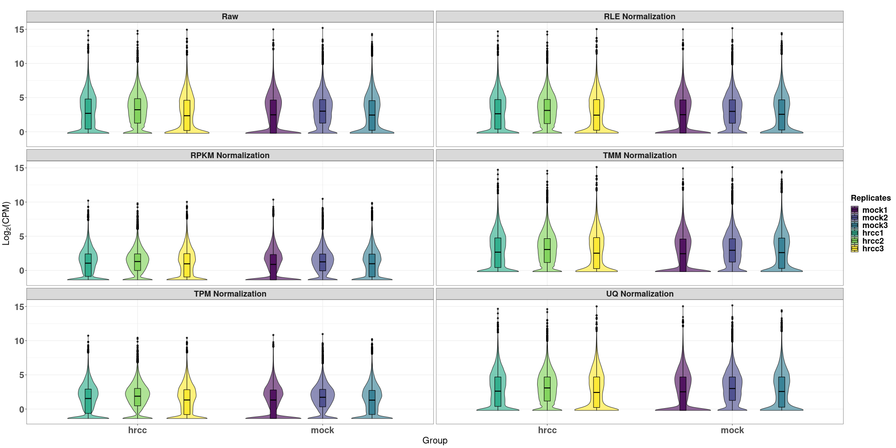
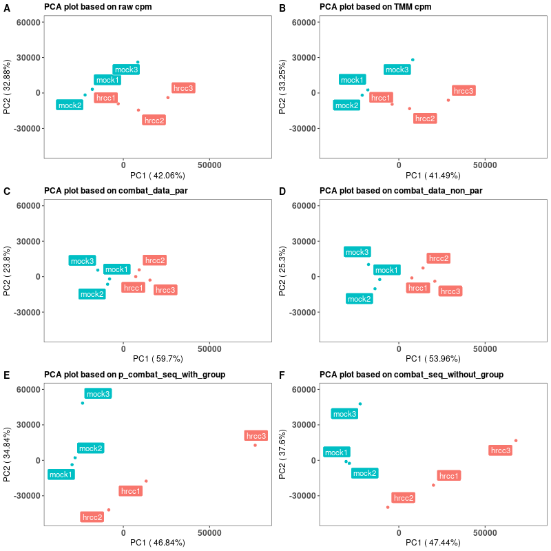

# Transformation, Normalization and Batch Effect Removal
## Introduction 
In bulk RNA-seq analysis, normalization and batch effect removal are two necessary procedures to scale the read counts and reduce the technical errors. Many differential expression analysis tools require raw count matrix as input and embed the normalization and batch effect removal procedures in the analysis pipeline, but researchers need to perform these two procedures independently when they build up their own bulk RNA profile analysis models. This protocol includes detailed codes and explanations of normalization and batch effect removal, which can help users understand and perform procedures more conveniently. We use the easily obtainable public Arabidopsis thaliana bulk RNA-seq dataset in the case study and researchers interested in this topic can use this protocol to learn and apply. 

**If users are interested in differential expression analysis, most of the DEG pipelines are requiring raw RNA counts matrix as input. This Chapter is more suitable for the users intended to developing their own pipeline or models which need to normalize the data and remove batch effects from raw counts**

**Folders:**
1. __input__: Example input dataset. 
2. __lib__: The source code, functions, or algorithms used within the workflow.
3. __output__: The final output results and figures of the workflow.
4. __workflow__: Step by step pipeline for normalization and batch effect removal.

## Overview of an example workflow: Normalization and batch effect removal 

Based on the raw RNA count dataset, we perform the normalization at first to remove the library size difference between arrays then apply batch effect removal procedure to reduce the batch effect. 


## Installation

- __Running environment__: 
    R version 4.1.1 (2021-08-10)

- __Required R Packages__: 
  - __Dataset__:
    [TxDb.Athaliana.BioMart.plantsmart28 (3.2.2)](https://bioconductor.org/packages/release/data/annotation/html/TxDb.Athaliana.BioMart.plantsmart28.html)
   - __Normalization__:
      [edgeR (3.34.0)](https://bioconductor.org/packages/release/bioc/html/edgeR.html), [limma (3.48.0)](https://bioconductor.org/packages/release/bioc/html/limma.html)
    - __Batch Effect Removal__:
      [sva (3.40.0)](https://bioconductor.org/packages/release/bioc/html/sva.html)
      
  - __Install & Load packages__:[pacman](https://cran.r-project.org/web/packages/pacman/index.html)

  - __Data Manipulation & Visualization__:
      [ggplot2](https://cran.r-project.org/web/packages/ggplot2/index.html),
      [stringr](https://cran.r-project.org/web/packages/stringr/index.html),
      [reshape2](https://cran.r-project.org/web/packages/reshape2/index.html),
      [dplyr](https://cran.r-project.org/web/packages/dplyr/index.html),
      [viridis](https://cran.r-project.org/web/packages/viridis/index.html),
      [ggpubr](https://cran.r-project.org/web/packages/ggpubr/index.html),
      [ggrepel](https://cran.r-project.org/web/packages/ggrepel/index.html),
      [hrbrthemes](https://cran.r-project.org/web/packages/hrbrthemes/index.html),
      [latex2exp](https://cran.r-project.org/web/packages/latex2exp/index.html)
       
## Input Data
To demonstrate different normalization methods and batch effect removal methods, we use the Arabidopsis thaliana RNA count data published by [Cumbie et al.](https://www.google.com/search?q=4.%09Cumbie%2C+J.+S.%2C+Kimbrel%2C+J.+A.%2C+Di%2C+Y.%2C+Schafer%2C+D.+W.%2C+Wilhelm%2C+L.+J.%2C+Fox%2C+S.+E.%2C+Sullivan%2C+C.+M.%2C+Curzon%2C+A.+D.%2C+Carrington%2C+J.+C.%2C+Mockler%2C+T.+C.+and+Chang%2C+J.+H.+%282011%29.+GENE-counter%3A+a+computational+pipeline+for+the+analysis+of+RNA-Seq+data+for+gene+expression+differences.+PLoS+One+6%2810%29%3A+e25279.&rlz=1C1CHBF_enUS890US890&ei=BhoIYrL1IJWgkPIP1LeMqA0&ved=0ahUKEwiykPn4gfv1AhUVEEQIHdQbA9UQ4dUDCA4&uact=5&oq=4.%09Cumbie%2C+J.+S.%2C+Kimbrel%2C+J.+A.%2C+Di%2C+Y.%2C+Schafer%2C+D.+W.%2C+Wilhelm%2C+L.+J.%2C+Fox%2C+S.+E.%2C+Sullivan%2C+C.+M.%2C+Curzon%2C+A.+D.%2C+Carrington%2C+J.+C.%2C+Mockler%2C+T.+C.+and+Chang%2C+J.+H.+%282011%29.+GENE-counter%3A+a+computational+pipeline+for+the+analysis+of+RNA-Seq+data+for+gene+expression+differences.+PLoS+One+6%2810%29%3A+e25279.&gs_lcp=Cgdnd3Mtd2l6EAMyBwgAEEcQsAMyBwgAEEcQsAMyBwgAEEcQsAMyBwgAEEcQsAMyBwgAEEcQsAMyBwgAEEcQsAMyBwgAEEcQsAMyBwgAEEcQsANKBAhBGABKBAhGGABQwQNYwQNgvAloAnABeACAAQCIAQCSAQCYAQCgAQKgAQHIAQjAAQE&sclient=gws-wiz) as an example. Users can use the data in the **input** folder. 
For the users who want to download the dataset, the following R scripts can be used. 
```
# Specify URL where file is stored
url <- "http://bioinf.wehi.edu.au/edgeR/UserGuideData/arab.rds"

# Specify destination where file should be saved
destfile <- "/path/to/save/arab.rds"

# Apply download.file function in R
download.file(url,destfile)
```


## Major steps
Under R or RStudio environment (R Version > 4.1.1), set working environment to `/path/to/Normalization-and-Batch-Effect-Removal/` 

```
setwd("/path/to/Normalization-and-Batch-Effect-Removal/"")
```

then source the scripts step by step (or directly use the `workflow/main.R` script). 

#### Step 1: Load the data and packages

```
source("workflow/Step_1_Load_Data_and_Packages.R")
```

Step 1 sets up the necessary packages and datasets. After running step 1 the R environment is ready for following steps. 

#### Step 2: Normalize the raw count matrix based on different methods

```
source("workflow/Step_2_Different_Normalization_Methods.R")
```

Step 2 performs 9 normalization methods on the same dataset. Normalization steps can be finished in a short time (about 3.419 seconds on testing datasets on [UCR HPCC](https://hpcc.ucr.edu/about/hardware/overview/)). After finishing step 2, users can get the normalized count datasets. The outputs data is stored in `output/datasets/rds_format/Normalization_Result.rds`.


#### Step 3: Remove batch effect based on normalized data
```
source("workflow/Step_3_Batch_Effect_Removal.R")
```
In step 3, the non-parametric empirical Bayes frameworks method.

```
combat_data_non_par <- ComBat(dat= TMM, batch=batch, mod=NULL, par.prior=FALSE, mean.only=TRUE)
```
takes about 1-2 hours to finish. For the users only want to test the function, they can input a subset TMM normalized count matrix to save time. For example, 

```
combat_data_non_par <- ComBat(dat= TMM[1:1000, ], batch=batch, mod=NULL, par.prior=FALSE, mean.only=TRUE)
```
Except the non-parametric empirical Bayes frameworks method, other methods of batch removal can be finished quickly (37.844 seconds on testing datasets on [UCR HPCC](https://hpcc.ucr.edu/about/hardware/overview/)). Step 3 can remove the batch effect based on the normalized datasets. Empirical Bayes frameworks and ComBat_seq methods require batch information as the input. However, when the batch information is unknown, we need to use the `sva` function to get the  vector of covariates to be adjusted for the put into the limma function `removeBatchEffect` to remove the batch effect. 

**The normalized and batch effect removed results are store in `output/datasets/rds_format/Batch_Effect_Removal_Result.rds`**

#### Step 4: Results visualization
```
source("workflow/Plot_Normalization_Violin_Plot.R")

source("workflow/Plot_PCA_Clustering_Distribution_After_Batch_Effect_Removal.R")
```
In order to compare the results from different normalization methods and bach effect removal methods, we draw the violin & box plot of normalized expression tp compare the distribution of gene expression after different normalizations. For the batch effect removal, we use PCA plot to check the results after different batch effect removal methods. Output figures are stored in `./output/figures/Violin_Boxplot_of_Normalized_Expression.png` and `./output/figures/PCA_Plot_of_Batch_Effect_Removed_Results.png`

## Expected results
**Violin & Box plot of normalized expression**


The log2(CPM) based on library size normalization methods (i.e. RLE, TMM and UQ) are similar with each other and no significant difference with the raw log2(CPM). However, the outcomes of RPKM and TPM are significant smaller than the other methods. Here we need to note RPKM is within sample normalization but RLE, TMM, UQ and TPM are cross sample normalization methods.  
**Note** the input raw library size of samples directly decide the outcomes of different normalization methods. The results based on example dataset cannot represent all cases so readers should select the appropriate normalization method based on the outcomes from their own input datasets.

**PC1 and PC2 plot based on different batch removal methods comparing with TMM normalized CPM and raw CPM**


PCA analysis to explore the performance of different batch effect removal methods in Figure 2. From the PCA analysis, we see the clustering of samples is not ideal that mock3 and hrcc3 are far from the other four samples, and we conject it is caused by the batch effects. C, D, E, and F in Figure 2 show the PCA clustering results based on 4 batch effect removal methods (parametric ComBat, non-parametric ComBat, ComBat_seq and SVA). In Figure 2C and Figure 2D, the PC1 percentage shows a significantly improve and two clusters sperate with each other clearly (control group on the left and hrcc group on the right). Therefore, the batch effect removal procedure can reduce the bias and we suggest researchers add it to their own research pipeline. 

## License
It is a free and open source software, licensed under []() (choose a license from the suggested list:  [GPLv3](https://github.com/github/choosealicense.com/blob/gh-pages/_licenses/gpl-3.0.txt), [MIT](https://github.com/github/choosealicense.com/blob/gh-pages/LICENSE.md), or [CC BY 4.0](https://github.com/github/choosealicense.com/blob/gh-pages/_licenses/cc-by-4.0.txt)).

